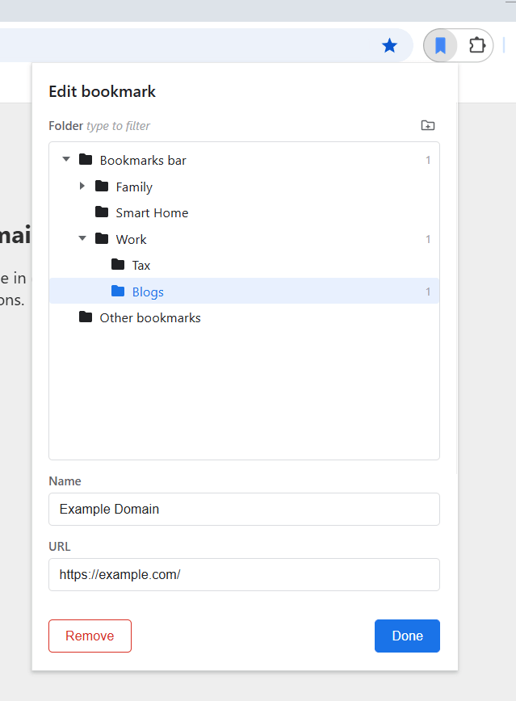

# Quick Add Bookmark

Chrome extension that replaces the default bookmark dialog with a full folder tree view. Bookmark is saved immediately on open. Simply pick a folder, tweak the name/URL if needed, and close.



It behaves like the default Chrome bookmarks popup, but without the initial dropdown, and the hidden "advanced mode".

To search through folders, simply start typing.

> Note: AI has been used to generate this extension. With that said, it's also an extension that I use personally, and I will be on-top of any bugs and UI improvements.

## Install

This extension will become available via Chrome Extension store once it's approved. But for now, you'll need to install it yourself.

1. Download the [latest .zip release](https://github.com/jeremy8883/quick-add-bookmark/releases), then extract to a location of choice.
1. Open `chrome://extensions` and enable **Developer mode**
1. Click **Load unpacked** and select the extracted extension

If you'd like to override the default "Add bookmark" shortcut, go to `chrome://extensions/shortcuts` and map "Quick Add Bookmark" to Ctrl + D.

## Build from source

Clone the repo and install dependencies:

```bash
npm install
npm run build
```

## Development

```bash
npm run watch     # rebuild on file changes
npm run build     # typecheck + bundle + copy assets to dist/
npm test          # run tests
```

Run `npm run` for all commands.
